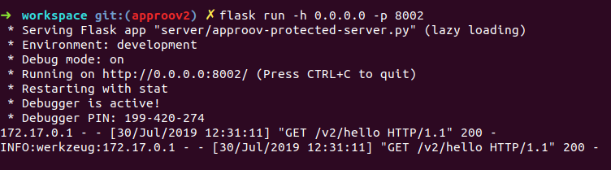
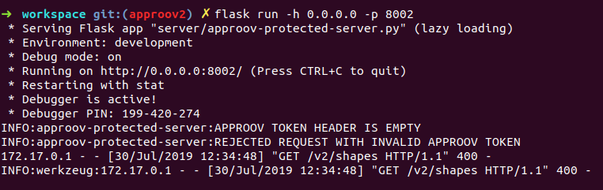
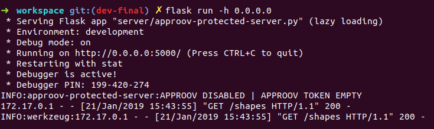
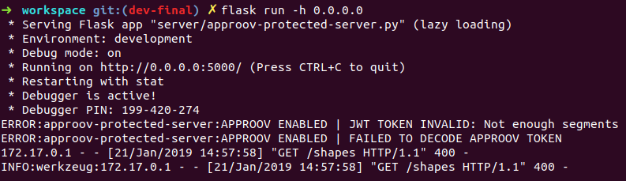
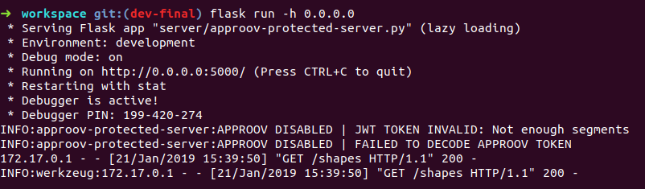
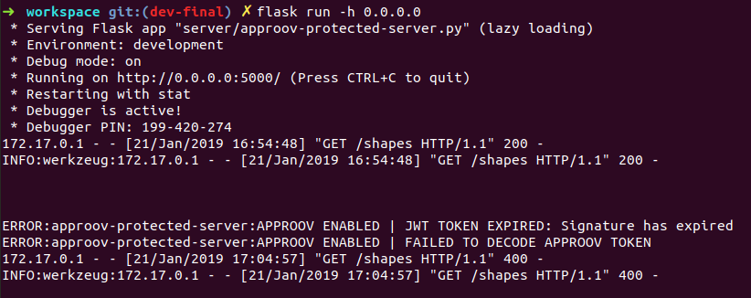
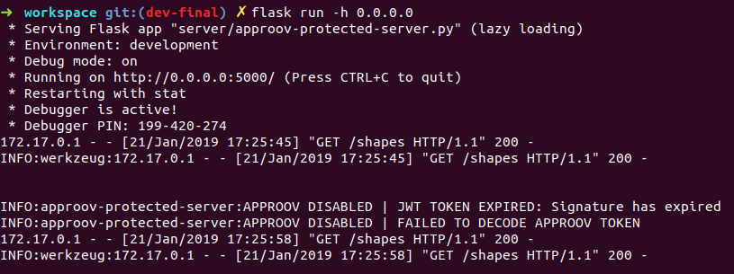
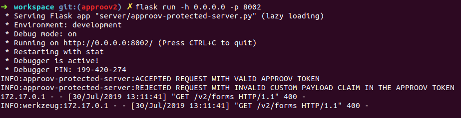
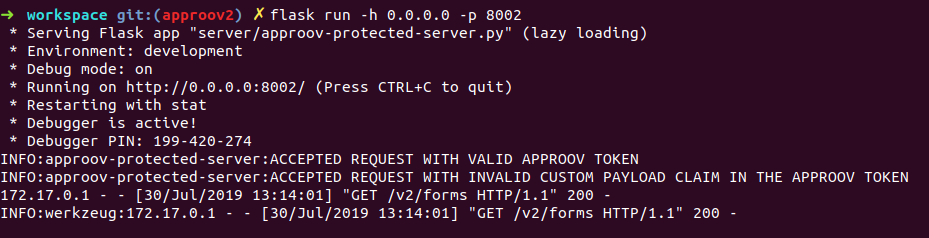
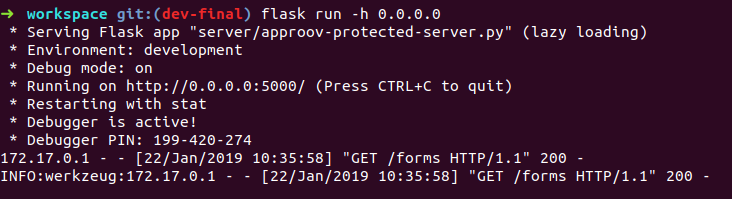

# APPROOV SHAPES DEMO SERVER

The Approov Shapes Demo Server contains endpoints with and without the Approov
protection. The protected endpoints differ in the sense that one uses the
optional custom payload claim in the Approov token.

We will demonstrate how to call each API endpoint with screen-shots from Postman
and from the shell terminal.


When presenting the screen-shots we will present them as 2 distinct views. The
Postman view will tell how we performed the request and what response we got
back and the shell view show us the log entries that lets us see the result of
checking the Approov token and how the requested was handled.


## REQUIREMENTS

* Python 3.
* Postman - to simulate calls to the the API server.

## INSTALL

### Approov Shapes Demo Server

Lets's start by cloning the demo:

```bash
git clone https://github.com/approov/python-flask_approov-shapes-demo-server.git \
cd python-flask_approov-shapes-demo-server
```

### Development Environment

In order to have an agnostic development environment through this tutorial we
recommend the use of Docker, that can be installed by following [the official
instructions](https://docs.docker.com/install/) for your platform.

A bash script `./stack` is provided in the root of the demo to make easy to use
the docker stack to run this demo.

#### Building the docker image:

```bash
./stack build server
```
> The image will contain the Python Flask Approov Shapes Demo Server with the
> dependencies already installed.

#### Getting a shell terminal inside the docker container:

```bash
./stack start shell
```
> If you choose to continue following this demo using Docker, then all subsequent
  shell commands must be executed from this shell terminal.

## SETUP

### Environment File

Lets' copy the `.env.example` to `.env` with the command:

```bash
cp .env-example .env
```

No modifications are necessary to the newly created `.env` in order to run the
demo with the provided Postman collection.

### Installing dependencies

When using the docker stack they are already installed, but on your own machine
you may want to create a virtual environment and then run:

```bash
pip3 install --local -r requirements.txt
```

## RUNNING THE APPROOV SHAPES DEMO SERVER

We will run this demo first with Approov enabled and a second time with Approov
disabled. When Approov is enabled any API endpoint protected by an Approov token
will have the request denied with a `400` response for each time the Approov
token check fails for any reason. When Approov is disabled the check still
takes place but no requests are denied, only the reason for the failure is
logged, if debug is enabled.

### The logs

When issuing a request from Postman you can see the logs being printed to your
shell terminal and you can search them for `APPROOV ENABLED | error level message here`
or by `APPROOV ENABLED | info level message here` to compare the logged messages
with results returned to Postman, regarding failure or success in the validation
of the requests protected by Approov.

An example of the logs output:

```bash
INFO:approov-protected-server:APPROOV DISABLED | APPROOV TOKEN EMPTY
INFO:approov-protected-server:APPROOV DISABLED | JWT TOKEN INVALID: Invalid token type. Token must be a <class 'bytes'>
INFO:approov-protected-server:APPROOV DISABLED | FAILED TO DECODE APPROOV TOKEN
172.17.0.1 - - [21/Jan/2019 13:31:57] "GET /shapes HTTP/1.1" 200 -
```

### Starting Postman

Open Postman and import [this collection](https://gitlab.com/snippets/1799104/raw)
that contains all the API endpoints prepared with all scenarios we want to
demonstrate.

### Starting the Python Flask Server

To start the server we want to issue the command:

```bash
flask run -h 0.0.0.0
```
> **NOTE**:
>
> The use of `-h 0.0.0.0` is only necessary when using the docker stack in order
> to expose the server outside of the container network, once by default it runs
> on `127.0.0.1`, that is only accessible from inside the container network.
>
> So in your computer you are free to just use `flask run -h 0.0.0.0` instead of
> `flask run -h 0.0.0.0`.

### Endpoint Not Protected by Approov

This endpoint does not benefit from Approov protection and the goal here is to
show that both Approov protected and unprotected endpoints can coexist in the
same API server.

#### /hello

**Postman View:**


> As we can see we have not set any headers.

**Shell view:**


> As expected the logs don't have entries with Approov errors.


**Request Overview:**

Looking into the Postman view, we can see that the request was sent without the
`approov-token` header and we got a `200` response that matches the one in the
logs output from the shell view.


### Endpoints Protected by an Approov Token

This endpoint requires a `approov-token` header and depending on the boolean
value for the environment variable `APPROOV_ENABLED` we will have 2 distinct
behaviours. When being set to `true` we refuse to fulfil the request and when
set to `false` we will let the request pass through. For both behaviours we
always log the result of checking the Approov token and any exception that may
occur during the process.

The default behaviour is to have `APPROOV_ENABLED` set to `true`, but you may
feel more comfortable to have it setted to `false` during the initial deployment,
until you are confident that you are only refusing bad requests to your API server.

#### /shapes - missing the Approov token header

Make sure that the `.env` file contains `APPROOV_ENABLED` set to `true`.

Cancel current server session with `ctrl+c` and start it again with:

```bash
flask run -h 0.0.0.0
```

**Postman view:**


> As we can see we have not set any headers.

**Shell view:**


> As expected status code in the logs matches the one in the Postman response.

**Request Overview:**

Looking to the Postman view we can see that we forgot to add the `approov-token`
header, thus a `400` response is returned.

In the shell view we can see in the logs entries that Approov is enabled and the Approov token is empty and this is the reason why the `400` response was
returned to Postman.

**Let's see the same request with Approov disabled**

Make sure that the `.env` file contains `APPROOV_ENABLED` set to `false`.

Cancel current server session with `ctrl+c` and start it again with:

```bash
flask run -h 0.0.0.0
```

**Postman view:**


> Did you notice that now we have a successfully response back?

**Shell view:**


> Can you see where are the new log entries?

**Request Overview:**

We continue to not provide the `approov-token` header but this time we have a
`200` response with the value for the shape, but once Approov is disabled the
request is not denied.

Looking into the shell view we can see that the logs continue to tell us that
the JWT token is empty, this time with the log level set to `INFO`, but now we
can see a log entry for the `/shapes` endpoint response with the status code
`200`, meaning that the request was fulfilled and a successful response sent back.


#### /shapes - Invalid Approov token header

Make sure that the `.env` file contains `APPROOV_ENABLED` set to `true`.

Cancel current server session with `ctrl+c` and start it again with:

```bash
flask run -h 0.0.0.0
```

**Postman view:**


> Did you notice the `approov-token` with an invalid JWT token?

**Shell view:**


> Can you spot what is the reason for the `400` response?

**Request Overview:**

In Postman we issue the request with an invalid `approov-token` header, that is
a normal string, not a JWT token, thus we get back a `400` response with the
debug code.

Looking to shell view we can see that the logs is also telling us that the
request was denied with a `400` and that the reason is an invalid JWT token,
that doesn't contain enough segments.


**Let's see the same request with Approov disabled**

Make sure that the `.env` file contains `APPROOV_ENABLED` set to `false`.

Cancel current server session with `ctrl+c` and start it again with:

```bash
flask run -h 0.0.0.0
```

**Postman view:**


**Shell view:**




**Request Overview:**

In Postman, instead of sending a valid JWT token, we continue to send the
`approov-token` header as a normal string, but this time we got a `200` response
back because Approov is disabled, thus not blocking the request.

In the shell view we continue to see the same reason for the Approov token
validation failure and we can confirm the `200` response as Postman shows.


#### /shapes - Valid Approov token header

Make sure that the `.env` file contains `APPROOV_ENABLED` set to `true`.

Cancel current server session with `ctrl+c` and start it again with:

```bash
flask run -h 0.0.0.0
```

> **NOTE**:
>
> For your convenience the Postman collection includes a token that only expires
> in a very distant future for this call "Approov Token with valid signature and
> expire time". For the call "Expired Approov Token with valid signature" an
> expired token is also included.
>

Feel free to generate your own fake tokens by tweaking
[this script](./server/test/helpers/generate-token.py) as needed and invoking
it like:

```bash
python3 server/test/helpers/generate-token.py

# or like:
python test/helpers/generate-token.js --expires-in 1m
```

**Postman view with token correctly signed and not expired token:**


**Postman view with token correctly signed but this time is expired:**


**Shell view:**




**Request Overview:**

We used an helper script to generate an Approov Token that was valid for 1
minute.

In Postman we performed 2 requests with the same token and the first one was
successful, but the second request, performed 2 minutes later, failed with a
`400` response because the token have already expired as we can see by the
log messages in the shell view.


**Let's see the same request with Approov disabled**

Make sure that the `.env` file contains `APPROOV_ENABLED` set to `false`.

Cancel current server session with `ctrl+c` and start it again with:

```bash
flask run -h 0.0.0.0
```
**Postman view with token valid for 1 minute:**


**Postman view with same token but this time is expired:**


**Shell view:**




**Request Overview:**

We repeated the process to generate the Appoov token with 1 minute of expiration
time.

Once more we performed the 2 requests with the same token and with 2 minutes
interval between them but this time we got both of them with `200` responses.

If we look into the shell view we can see that the first request have
a valid token and in the second request the token is not valid because is
expired.

### Endpoints Protected by an Approov Token with Custom Payload Claim

A custom payload claim in an Approov token is a base64 encoded hash of some
unique identifier we may want to to tie with the Approov token, like an OAUTH2
token, but you are free to use what so ever you may want.

JWT dummy example for the payload part:

```json
{
    "iss":"custom",
    "pay":"f3U2fniBJVE04Tdecj0d6orV9qT9t52TjfHxdUqDBgY="
}
```

> **NOTE**
>
> Just to be sure that we are on the same page, a JWT token have 3 parts, that
> are separated by dots and represented as a string in the format of
> `header.payload.signature`, thus the above section is an example for the
> middle part, the `payload` one.

The custom payload claim in an Approov token is the one in the `pay` key:

```
"pay":"f3U2fniBJVE04Tdecj0d6orV9qT9t52TjfHxdUqDBgY="
```

**ALERT**:

Please bear in mind that the custom payload claim is not meant to pass
application data to the API server, but you can pass a base64 encoded hash of
the data you want to send from the mobile app into the API server and have it
hashing the data that was sent as usual on the request and compare it with the
custom payload claim base64 hash to confirm that the integrity of the data was
not compromised.


#### /forms - Invalid Custom Payload Claim in the Approov token

Make sure that the `.env` file contains `APPROOV_ENABLED` set to `true`.

Cancel current server session with `ctrl+c` and start it again with:

```bash
flask run -h 0.0.0.0
```

**Postman view:**


**Shell view:**



**Request Overview:**

In Postman we added an Approov token with a custom payload claim not matching
the OAUTH2 token, thus the API server rejects the request with a `400` response.

The shell view logs entries confirms the custom payload claim is not the expect
one with the message `APPROOV TOKEN WITH INVALID PAYLOAD` and that a `400`
response was returned.

**Let's see the same request with Approov disabled**

Make sure that the `.env` file contains `APPROOV_ENABLED` set to `false`.

Cancel current server session with `ctrl+c` and start it again with:

```bash
flask run -h 0.0.0.0
```

**Postman view:**


**Shell view:**



**Request Overview:**

We still have the invalid custom payload claim in the Approov token but once we
have disabled Approov we now have a `200` response.

In the shell view we can confirm that with the log message `APPROOV DISABLED | APPROOV TOKEN WITH INVALID PAYLOAD` and also see that it was logged a `200`
response instead of the `400` one when Approov is enabled.


#### /forms - Valid Custom Payload Claim in the Approov token

Make sure that the `.env` file contains `APPROOV_ENABLED` set to `true`.

Cancel current server session with `ctrl+c` and start it again with:

```bash
flask run -h 0.0.0.0
```

**Postman view:**


**Shell view:**



**Request Overview:**

In Postman the Approov token header contains a valid custom payload claim, thus
when we perform the request the API server doesn't reject it and a `200`
response is sent back.

The shell view doesn't show any Approov validation errors and we can see the log
entry confirming the `200` response.
